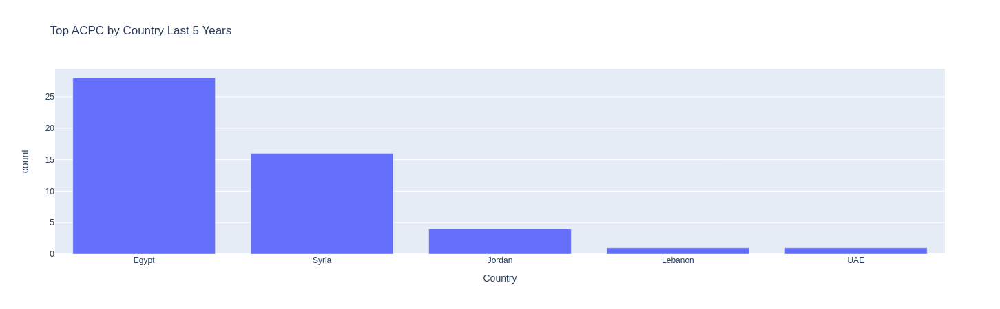

# Top ACPC MENA Region Study
This repository for Data Analytics of ACPC International Programming Championship result for Africa and Arabia region of the last 5 years from 2019 to 2023.

It contains Expolrity Data Analytics for the result by different metrics including:
* Top ACPC by Countries for last 5 years
* Top ACPC by Institution for last 5 years
* Top ACPC 3 teams by Country for the last 5 years

It also visulize metrics using Pie and Bar charts

Check the complete [data anlytics Notebook](acpc_analytics.ipynb) for the study.

## Reference

The dataset used for conducting the study from the official [ICPC platform](https://icpc.global/regionals/results/2024)

* [ACPC 2023 Standings](https://icpc.global/regionals/finder/ACPC-2024/standings)

* [ACPC 2022 Standings](https://icpc.global/regionals/finder/ACPC-2023/standings)

* [ACPC 2021 Standings](https://icpc.global/regionals/finder/ACPC-2022/standings)

* [ACPC 2020 Standings](https://icpc.global/regionals/finder/ACPC-2021/standings)

* [ACPC 2019 Standings](https://icpc.global/regionals/finder/ACPC-2020/standings)
